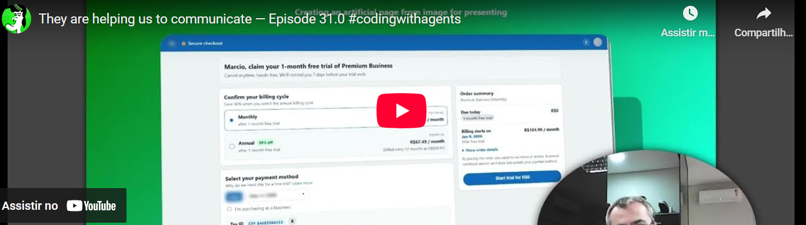
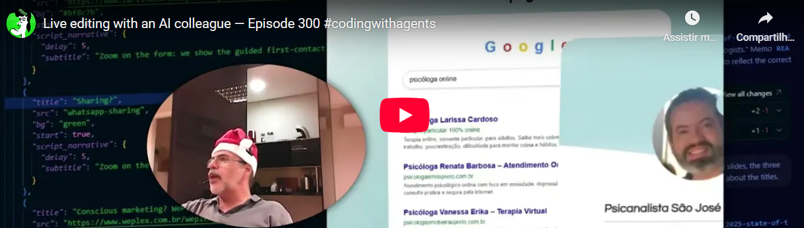
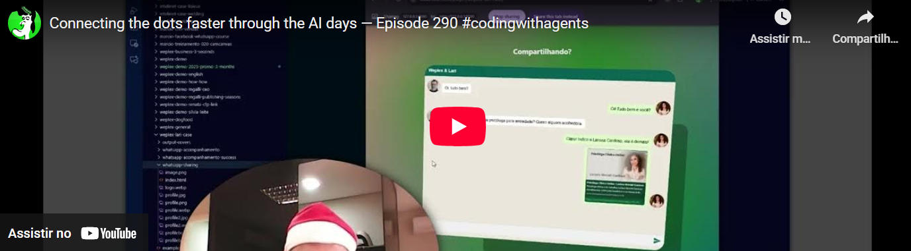
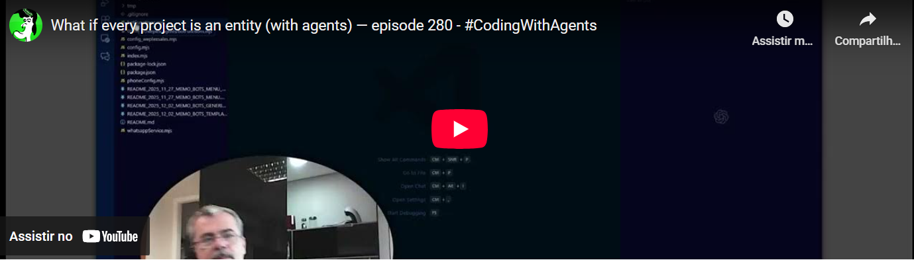
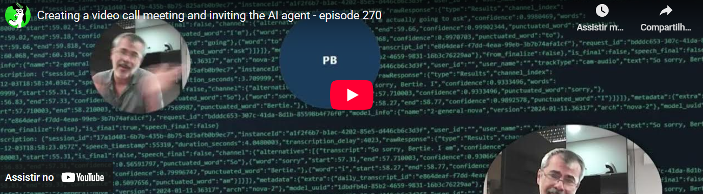
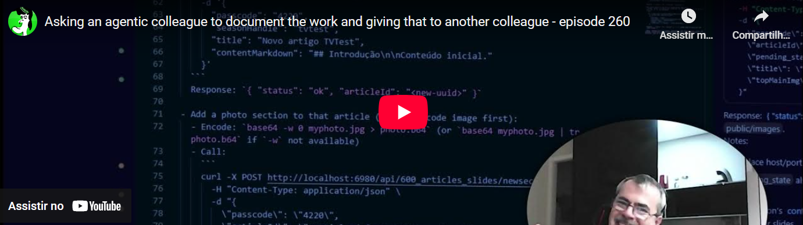

# The Pipeline Cockpit Rec Studio - How to Record Screencasts with Your Local Web App 

This project is based on the WebRTC JavaScript code samples. I took some of the samples and made a custom user interface to attend special needs. What is the different in this project?

It uses a "two-fold" recording scheme. I can explain. We have a local page, provided by this system and for now being called "Cockpit". This one is responsible for capturing a source of your choice, like another tab or a desktop of your computer. In addition, we have another local page, named "Recorder" which you can use to capture the said "Cockpit".  So it's a pipeline. 

## Demo 

* [https://www.youtube.com/watch?v=XS-d2p9Q7ew](https://www.youtube.com/watch?v=XS-d2p9Q7ew)


## Installation

```bash
npm install
npm start
```

## Examples recorded with this app 

[](https://www.mgalli.com/a/2025-12-09-demos-e310_they_are_helping_us_to_communicate_episode_31_0)

[](https://www.mgalli.com/a/2025-12-08-demos-e300_live_editing_with_an_ai_colleague_episode_300)

[](https://www.mgalli.com/a/2025-12-08-demos-e290_connecting_the_dots_faster_through_the_ai_days_episode_290)

[](https://www.mgalli.com/a/2025-12-04-demos-e280_what_if_every_project_is_an_entity_with_agents_episode_280)

[](https://www.mgalli.com/a/2025-12-03-demos-e270_creating_a_video_call_meeting_and_inviting_the_ai_agent_episode_270)

[](https://www.mgalli.com/a/2025-12-02-demos-e260_asking_the_agentic_colleague_to_document_the_work_and_giving_that_to_another_colleague_episode_260)


## Helped you? 

Get in touch to send your supporting push to this bitcoin wallet address bc1qd7y7d2875ujj5uzm2eufe5zjj42ps0ye6g9cq5

## Author site

http://www.mgalli.com

## Attribution and License

This project is based on the WebRTC JavaScript code samples: https://github.com/webrtc/samples

License: [BSD-3-Clause](LICENSE.md)
