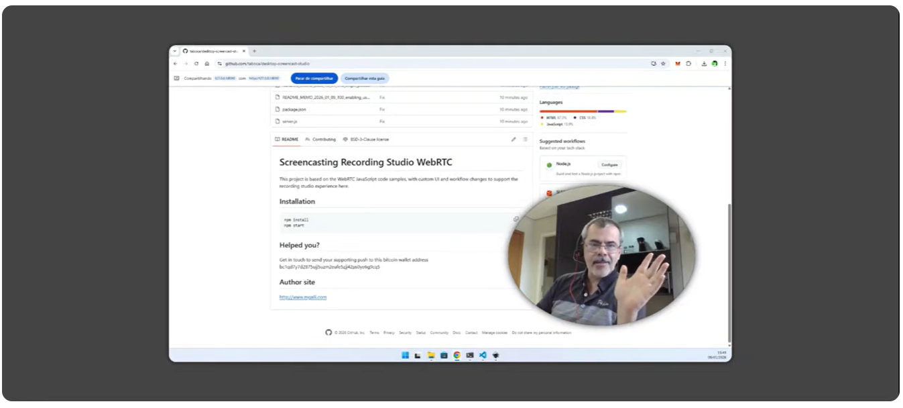

# Screencasting Recording Studio WebRTC

This project is based on the WebRTC JavaScript code samples, with custom UI and workflow changes to support the recording studio experience here.

## Demo 

* [https://www.youtube.com/watch?v=XS-d2p9Q7ew](https://www.youtube.com/watch?v=XS-d2p9Q7ew)



## Installation

```bash
npm install
npm start
```
## Helped you? 

Get in touch to send your supporting push to this bitcoin wallet address bc1qd7y7d2875ujj5uzm2eufe5zjj42ps0ye6g9cq5

## Author site

http://www.mgalli.com

## Attribution and License

This project is based on the WebRTC JavaScript code samples: https://github.com/webrtc/samples

License: [BSD-3-Clause](LICENSE.md)
